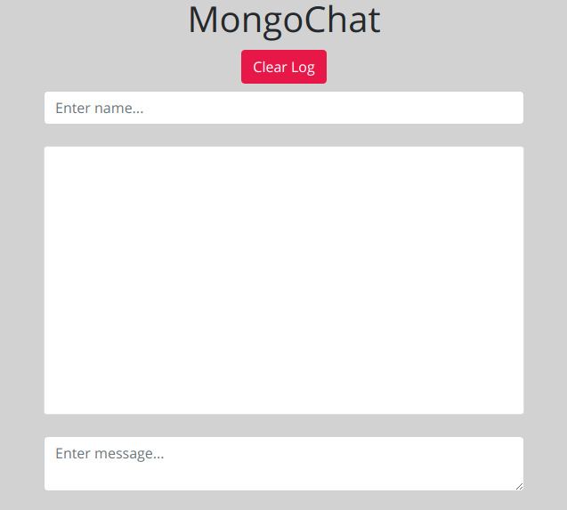

# MongoChat - Simple Chat App with MongoDB & SocketIO

## Table of Contents

- [Installation](#installation)
- [Technologies](#technologies)

### Installation

Step One: Clone this repo to your local machine  
Step Two: npm install  
Step Three: npm start  

### Technologies

